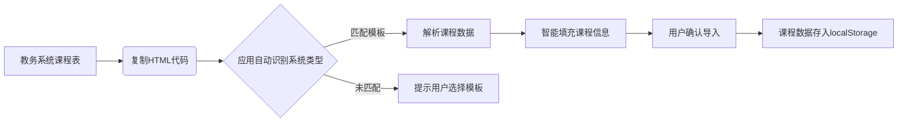

```md
# 知课

**知课** 是一个功能丰富的课程表管理应用，帮助学生高效规划和管理自己的课程安排。它支持多种自定义选项，包括单双周设置、隐藏周末、自定义课程节数和时间等，**特别支持从教务系统直接导入课程表**，让课程表管理变得简单直观。

## 🌟 主要功能

### 📅 课程表管理
- 以清晰的表格形式展示一周的课程安排
- 支持添加、编辑和删除课程
- 自动合并连续相同课程的单元格
- 为不同课程设置不同颜色标识

### 🔄 周数与时间设置
- 设置第一周起始日期，自动计算当前周数
- 跳转到任意周数（1-20周）
- 单双周课程设置（仅单周/仅双周）
- 隐藏周末选项（可选择是否显示周六、周日）

### ⚙️ 自定义设置
- 自定义课程节数（1-50节）
- 自定义每节课的时间段
- 调整界面字体大小（小/标准/大/超大）
- 课程颜色选择（12种预设颜色）

### 📱 移动端优化
- 响应式设计，适配手机和平板
- 触摸滑动切换页面
- 浮动按钮快速打开教务系统

### 📚 课程表导入（核心创新功能）
- **一键导入教务系统课程表**：无需手动输入，直接解析教务系统HTML结构
- **智能匹配课程信息**：自动提取课程名称、时间、地点、教师等信息
- **支持多种教务系统**：预设常见教务系统模板（超星、正方、蓝墨等）
- **自定义解析规则**：可为不常见系统添加自定义解析模板

### 💾 数据管理
- 所有数据存储在本地（localStorage）
- 课程数据持久化，无需重新输入
- 支持导出/导入课程数据（通过DOM解析）

## 🔧 项目原理

### 数据结构
课程数据以JSON格式存储在`localStorage`中：

```json
{
  "id": "唯一标识",
  "name": "课程名称",
  "location": "上课地点",
  "teacher": "授课教师",
  "classTime": "节次",
  "weekdays": ["星期几数组"],
  "startWeek": "开始周数",
  "endWeek": "结束周数",
  "color": "课程颜色",
  "oddWeek": "是否单周",
  "evenWeek": "是否双周",
  "excludedWeeks": ["被排除的周数"]
}
```

### 核心算法

#### DOM解析与课程导入（关键技术）
```javascript
// 从教务系统HTML解析课程表
function parseCourseTableFromHTML(html, systemTemplate) {
  const parser = new DOMParser();
  const doc = parser.parseFromString(html, 'text/html');
  
  // 根据预设模板定位课程表
  const table = doc.querySelector(systemTemplate.tableSelector);
  
  // 遍历表格行和单元格
  const courses = [];
  for (const row of table.rows) {
    const cells = row.cells;
    
    // 跳过表头
    if (row.rowIndex === 0) continue;
    
    // 根据模板提取信息
    const course = {
      name: systemTemplate.extractName(cells, systemTemplate.nameIndex),
      location: systemTemplate.extractLocation(cells, systemTemplate.locationIndex),
      teacher: systemTemplate.extractTeacher(cells, systemTemplate.teacherIndex),
      weekdays: systemTemplate.extractWeekdays(cells, systemTemplate.weekdayIndex),
      classTime: systemTemplate.extractClassTime(cells, systemTemplate.classTimeIndex)
    };
    courses.push(course);
  }
  return courses;
}

// 示例：超星教务系统模板
const CHAOXING_TEMPLATE = {
  tableSelector: '.course-table',
  nameIndex: 1,
  locationIndex: 3,
  teacherIndex: 4,
  weekdayIndex: 0,
  classTimeIndex: 2
};
```

### 课程表导入工作流程


### 📥 课程表导入步骤（关键功能）
1. **在教务系统中**：打开课程表页面 → 点击右侧“+”按钮
2. **解析导入**：点击"+"按钮后 → 检查结果 → 确认导入

> 💡 **提示**：系统会自动匹配常见教务系统模板（如正方，超星），如匹配失败可手动添加课程
## 📂 项目结构
```
course-schedule-manager/
├── index.html          # 主页面
├── style.css           # 样式文件
├── script.js           # 核心逻辑
├── huoqu.js            # DOM解析与课程导入功能
├── templates/          # 教务系统解析模板
│   ├── default.json    # 默认模板
│   ├── chaoxing.json   # 超星模板
│   └── zhengfang.json  # 正方模板
├── README.md           # 本文件
└── assets/             # 图标/图片资源
```

## ⚙️ 技术栈
| 技术          | 用途                          |
|---------------|-----------------------------|
| HTML5         | 语义化页面结构                |
| CSS3          | 响应式布局与动画              |
| JavaScript    | 核心逻辑与DOM操作             |
| localStorage  | 本地数据持久化                |
| DOMParser     | 教务系统HTML解析              |
| Material Design | UI设计规范                   |

## 📧 联系方式
如有问题或建议，请通过邮箱联系：  
[kanxi12138@126.com](mailto:kanxi12138@126.com)

---

> **为什么选择知课？**  
> 通过创新的DOM解析技术，**告别手动输入课程的繁琐**。只需3步即可导入教务系统课程表，智能匹配课程信息，让课程管理效率提升10倍！特别适合高校学生快速建立个性化课程表。
```